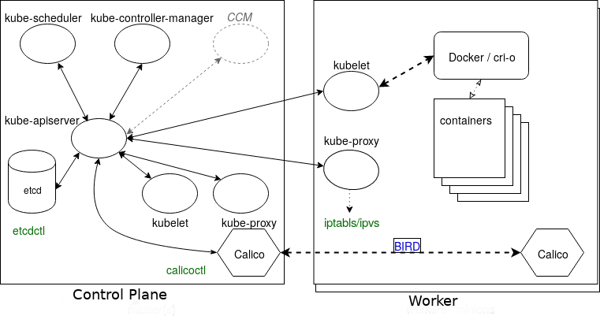

## Kubernetes Architecture

### Main Components
- Control Plane and worker nodes
- Operators
- Services
- Pods of containers
- Namespaces and quotas
- Network and policies
- Storage


---
## Control Plane

- kube-apiserver
- kube-scheduler
- etcd
- others
  - kube-controller-manager
  - cloud-controller-manager

## Worker Node
- kubelet
  - Uses PodSpec
  - Mounts volumes to Pod
  - Downloads Secrets
  - Passes request to local container engine
  - Reports status of Pods and node to cluster
- kube-proxy (iptables / ipvs)
- docker or cri-o
- fluentd : 클러스터 전체 로깅
- metrics-server
- Prometheus

## Operators
- known as controllers or watch-loops

## Service Operator
- Connect Pods together
- Expose Pods to Internet
- Decouple settings
- Define Pod access policy


## Pods
- the smallest unit we can work with is a Pod
- one-process-per-container architecture

## Rewrite Legacy Applications

## Container
- In the resources section of the PodSpec
```yaml
resources:
  limits: 
    cpu: "1"
    memory: "4Gi" 
  requests:
    cpu: "0.5"
    memory: "500Mi"
```
- ResourceQuota
- priorityClassName and scopeSelector

## Init Containers
- LivenessProbes, ReadinessProbes, StatefulSets
- Init container : must complete before app containers will be started
```yaml
spec:
  containers:
  - name: main-app
    image: databaseD 
  initContainers:
  - name: wait-database
    image: busybox
    command: ['sh', '-c', 'until ls /db/dir ; do sleep 5; done; '] 
```

## Component Review
- all of the components are communicating with kube-apiserver
- Only kube-apiserver communicates with the etcd database



- etcdctl : command to interrogate the database
- calicoctl : to view more of how the network is configured
- Felix : the primary Calico agent on each machine
  - This agent, or daemon, is responsible for interface monitoring and management, route programming, ACL configuration and state reporting
- BIRD : dynamic IP routing daemon used by Felix to read routing state and distribute that information to other nodes in the cluster
  - This allows a client to connect to any node, and eventually be connected to the workload on a container, even if not the node originally contacted

## API Call Flow
